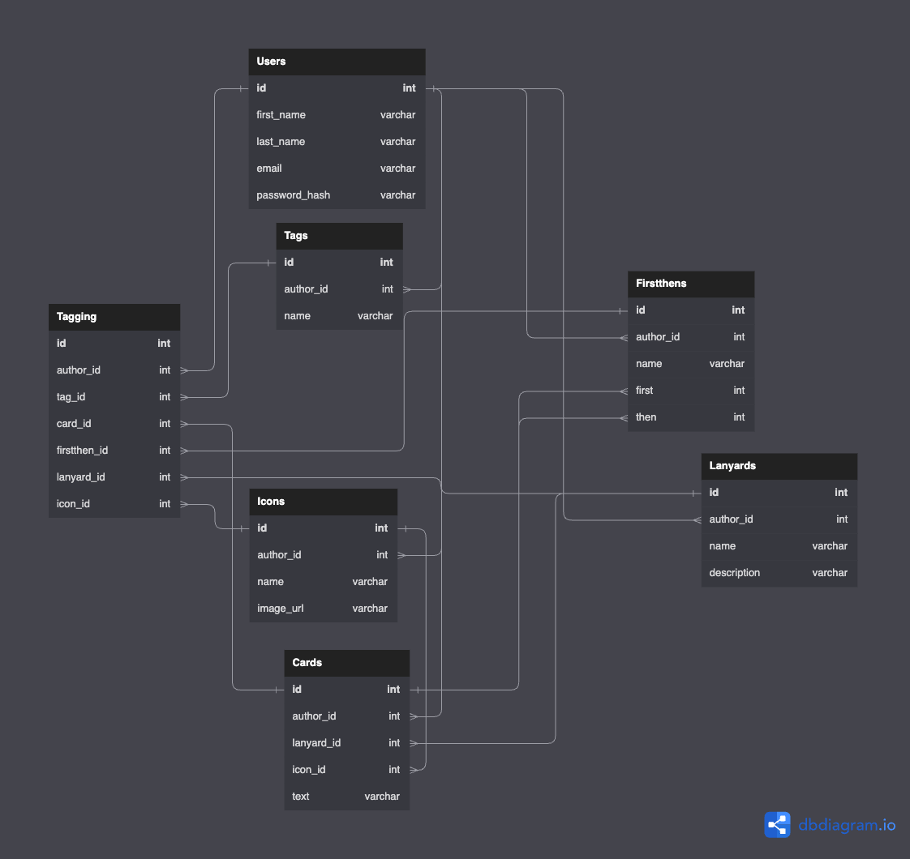

# my-lanyard (backend)

## API Routes

### POST `/api/session`

> Used to login a user.

### GET `/api/session`

> Used to restore a user's session if their cookie is still valid.

### DELETE `/api/session`

> Used to logout a user.

### POST `/api/users`

> Used to signup a new user. Will error if the email is already in use.

### PATCH `/api/users`

> Used to update the current user's personal info.

### PATCH `/api/users/password`

> Used to update the current user's password.

### POST `/api/icons`

> Create an icon for the current user.

### GET `/api/icons`

> Get all icons created by current user and the premade icons.

### GET `/api/icons/instance/:id`

> Get a specific icon. Will error if `id` points to an icon the user does not have access to.

### PATCH `/api/icons/instance/:id`

> Update a specific icon. Will error if `id` points to an icon the user does not have access to.

### DELETE `/api/icons/instance/:id`

> Remove a specific icon. Will error if `id` points to an icon the user does not have access to. This will also delete any cards that reference this icon.

### POST `/api/icons/tagging`

> Add/remove tagging relationship(s) to an icon.

### GET `/api/icons/taggings`

> Get all tagging relationships for all icons.

### GET `/api/icons/tagging/:id`

> Get a specific tagging relationship for an icon.

### GET `/api/icons/instance/:id/taggings`

> Get all tagging relationships for a specific icon.

### DELETE `/api/icons/tagging/:id`

> Remove a specific tagging relationship from a specific icon.

### POST `/api/cards`

> Create a card for the current user.

### GET `/api/cards`

> Get all cards created by current user and the premade cards.

### GET `/api/cards/instance/:id`

> Get a specific card. Will error if `id` points to a card the user does not have access to.

### PATCH `/api/cards/instance/:id`

> Update a specific card. Will error if `id` points to a card the user does not have access to.

### DELETE `/api/cards/instance/:id`

> Remove a specific card. Will error if `id` points to a card the user does not have access to. This will also delete any lanyards that reference this card **AND** do not contain any other cards.

### POST `/api/cards/tagging`

> Add/remove tagging relationship(s) to a card.

### GET `/api/cards/taggings`

> Get all tagging relationships for all cards.

### GET `/api/cards/tagging/:id`

> Get a specific tagging relationship for a card.

### GET `/api/cards/instance/:id/taggings`

> Get all tagging relationships for a specific card.

### DELETE `/api/cards/tagging/:id`

> Remove a specific tagging relationship from a specific card.

### POST `/api/lanyards`

> Create a lanyard for the current user.

### GET `/api/lanyards`

> Get all lanyards created by current user and the premade lanyards.

### GET `/api/lanyards/instance/:id`

> Get a specific lanyard. Will error if `id` points to a lanyard the user does not have access to.

### PATCH `/api/lanyards/instance/:id`

> Update a specific lanyard. Will error if `id` points to a lanyard the user does not have access to.

### DELETE `/api/lanyards/instance/:id`

> Remove a specific lanyard. Will error if `id` points to a lanyard the user does not have access to.

### POST `/api/lanyards/tagging`

> Add/remove tagging relationship(s) to a lanyard.

### GET `/api/lanyards/taggings`

> Get all tagging relationships for all lanyards.

### GET `/api/lanyards/tagging/:id`

> Get a specific tagging relationship for a lanyard.

### GET `/api/lanyards/instance/:id/taggings`

> Get all tagging relationships for a specific lanyard.

### DELETE `/api/lanyards/tagging/:id`

> Remove a specific tagging relationship from a specific lanyard.

### POST `/api/tags`

> Create a tag for the current user.

### GET `/api/tags`

> Get all tags created by current user and the premade tags.

### GET `/api/tags/instance/:id`

> Get a specific tag. Will error if `id` points to a tag the user does not have access to.

### PATCH `/api/tags/instance/:id`

> Update a specific tag. Will error if `id` points to a tag the user does not have access to.

### DELETE `/api/tags/instance/:id`

> Remove a specific tag. Will error if `id` points to a tag the user does not have access to.

## Database Schema

